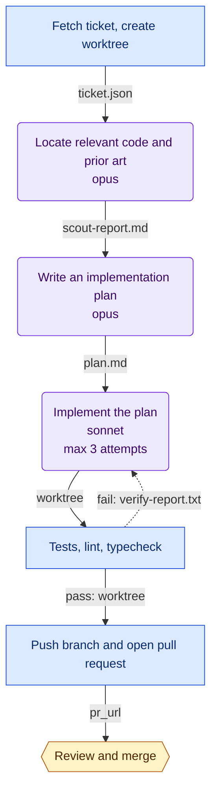

# ticket-to-pr

**Goal.** Take an accepted ticket to a pull request that passes verification, with human judgment only at intake and acceptance

**Trigger.** A ticket moves to Ready in the tracker

**Isolation.** `worktree`

**Shape.** 7 nodes — 3 code, 3 agent, 1 human; 7 edges, 1 of them loops.

## Diagram

## Nodes

| Node | Who | What | Model | Retries |
|---|---|---|---|---|
| `intake` | Code | GET the ticket from the tracker API, write ticket.json, git worktree add a branch named for the ticket id | — | — |
| `scout` | Agent | Read the ticket and find the files, tests, conventions, and past changes that bear on it. Do not modify anything. | opus | — |
| `plan` | Agent | Turn the ticket and scout report into a concrete ordered plan: files to change, approach, and how it will be verified. | opus | — |
| `build` | Agent | Execute plan.md. On a retry, the verification report explains what failed; fix that specifically rather than reworking the approach. | sonnet | 3, then human |
| `verify` | Code | make verify — exits non-zero on any failure and writes verify-report.txt | — | — |
| `open_pr` | Code | git push, then gh pr create with the plan as the description body | — | — |
| `accept` | Human | Decide whether the change is correct and wanted. Merging is irreversible enough to warrant a person. | — | — |

## Flow

| From | Condition | Carries | To |
|---|---|---|---|
| `intake` | always | `ticket.json` | `scout` |
| `scout` | always | `scout-report.md` | `plan` |
| `plan` | always | `plan.md` | `build` |
| `build` | always | `worktree` | `verify` |
| `verify` | pass | `worktree` | `open_pr` |
| `verify` | fail (loop) | `verify-report.txt` | `build` |
| `open_pr` | always | `pr_url` | `accept` |

## Where people are involved

- **`accept` — Review and merge.** Decide whether the change is correct and wanted. Merging is irreversible enough to warrant a person.

Human touchpoints belong at intake and acceptance, plus any step whose next action is irreversible. Interior gates cap throughput at one person's attention regardless of available compute — if any of the above sits in the middle, check that the action after it genuinely cannot be undone.

## Model and tool allocation

| Node | Model | Tools |
|---|---|---|
| `scout` | opus | `Read`, `Grep`, `Glob` |
| `plan` | opus | `Read`, `Grep`, `Glob`, `Write` |
| `build` | sonnet | all |

Scouting and planning decide what everything downstream does, so errors there propagate and get faithfully implemented — those are the nodes worth the strongest model. Mechanical transforms are where a cheaper tier pays off. Narrowing tools on read-only nodes is both a cost control and a safety property.

## Open questions

Unresolved. Each of these is a hole in the design, deliberately left visible:

- How does the workflow authenticate to the tracker and to GitHub in an unattended run?
- When accept rejects, does the ticket return to Ready for a fresh run, or reopen the existing worktree?
- Is `make verify` fast enough to sit inside a retry loop, or does it need a quick subset for the loop and a full run before open_pr?

## Testing a single node

Every edge names its payload, so any node can be run against a fixed input rather than by replaying the whole workflow. The generated scaffold exposes this as `--only <node>`, reading that node's inputs from the run directory. Retry granularity is node granularity: if debugging forces you to rerun everything, the boundaries are in the wrong place.
